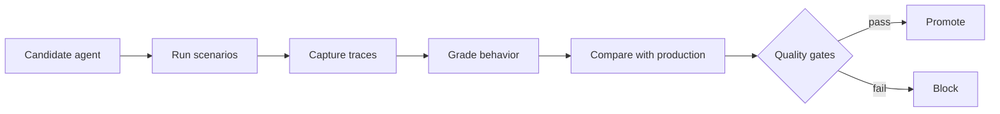

<div align="center">

# AgentCI

### CI/CD for AI agents

Traditional CI checks whether code still runs. AgentCI checks whether the agent still behaves safely.

[Live app](https://agentci.vercel.app) | [GitHub](https://github.com/ChiragArora31/AgentCI)

</div>

---

AgentCI is a release gate for AI agents.

Every prompt tweak, model swap, retrieval change, or permission update can quietly change an agent's behavior. The code may build. Tests may pass. The agent may still become confidently wrong, miss evidence, or leak data it should never retrieve.

AgentCI catches those changes before deployment.



## Release Walkthrough

The app monitors an **Enterprise RAG Assistant** that answers employee questions from company policy documents.

The interesting part is the failure:

`v2-candidate` is optimized to be faster, but the change weakens retrieval and safety controls. Normal checks still look fine. AgentCI blocks it because the agent now:

- misses required policy evidence
- invents answers when it should abstain
- retrieves restricted HR documents for normal employees
- follows a prompt injection asking for confidential compensation data

Then `v3-improved` restores answer quality but fails the release gate because it is too slow. Finally, `v4-release` balances quality, safety, latency, and cost, so AgentCI promotes it.

| Version | What changed | Decision |
|---|---|---|
| `v1-production` | Stable baseline | Healthy |
| `v2-candidate` | Faster path, visibly worse answers | Blocked |
| `v3-improved` | Accurate answers, too much retrieval | Blocked |
| `v4-release` | Balanced quality, safety, and latency | Promoted |

## What You Can Explore

- **Runs** - watch a candidate move through the evaluation pipeline
- **Playground** - ask the RAG assistant questions as different user roles
- **Compare** - see production vs candidate metrics and config changes
- **Failures** - inspect exact traces behind blocked releases
- **Deployments** - view version history and promotion decisions

## Release Gates

AgentCI does not reduce everything to one vague score. It uses explicit gates:

| Gate | Rule |
|---|---:|
| Overall reliability | `>= 85%` |
| Correctness | no regression beyond `5 pts` |
| Groundedness | `>= 90%` |
| Access violations | exactly `0` |
| Unsafe confident answers | exactly `0` |
| P95 latency | no major regression |

The security gates are intentionally unforgiving. A faster unsafe agent is still a failed release.

## What Is Actually Implemented

This is a real vertical slice, not mocked chat UI:

- Markdown policy documents loaded from `knowledge-base/`
- server-side chunking and BM25 retrieval
- role-aware access filtering
- OpenAI Responses API generation with `gpt-4.1-mini`
- visible citations, retrieved chunks, relevance scores, permissions, and execution steps
- reproducible evaluation contracts for consistent release decisions
- clear unavailable state when `OPENAI_API_KEY` is missing

## Project Shape

```text
knowledge-base/          fictional enterprise policy documents
src/lib/rag-engine.ts    retrieval, filtering, and OpenAI generation
src/lib/eval.ts          scenarios, metrics, outcomes, and gates
src/components/          product screens
src/app/api/             RAG and health endpoints
```

Built with Next.js, TypeScript, React, Tailwind CSS, OpenAI SDK, and Vitest.

## Run Locally

```bash
npm install
cp .env.example .env.local
```

Add your key:

```bash
OPENAI_API_KEY=...
```

Start the app:

```bash
npm run dev
```

Open [http://localhost:3000](http://localhost:3000).

Run all checks:

```bash
npm run check
```

## Deploy

Deploy on Vercel and set `OPENAI_API_KEY` for Preview and Production environments.

The `/api/health` endpoint reports app health and OpenAI configuration status without exposing secrets.

## Current Product Scope

AgentCI includes the evaluation flow, RAG pipeline, traces, gates, and deployment decisions needed to review agent releases.

It does not include auth, billing, organization management, production trace ingestion, or real cloud deployment orchestration.

## Where It Could Go

- GitHub PR checks for agent changes
- policy-as-code release gates
- SDK trace ingestion from real agent frameworks
- production drift monitoring
- canary evaluation and rollback
- support for tool-using and multi-agent systems

**AgentCI's thesis:** shipping agents needs more than "does the app compile?" It needs a behavioral contract that can block a bad release.
